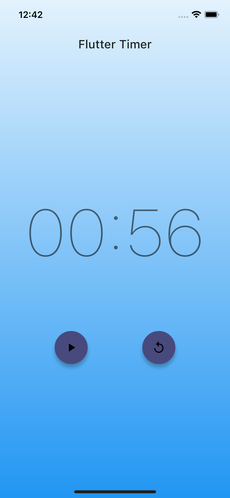

# bloc_timer

Luke's BLOC and Flutter Timer.

## Getting Started

This project uses the BLOC pattern to manage state and control events for a simple timer application.  There is a bloc state for all variations of the timer which allows for fine grained control.  There is also an event for each interaction a user can have with this timer.  The timer bloc itself makes the events, states, and ticker work together.  For more details check out the code in the bloc directory nested in the lib folder!

## Running locally

Simply clone this public repository and run with your choice of IDE on an emulator or simulator.  No setup required!

